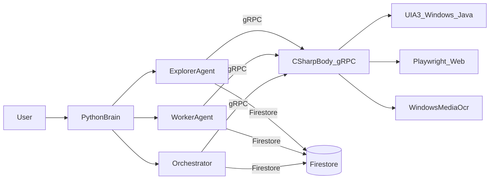

# Cascade: Architecture + Agent Development Rules

This repository is **Cascade**: a desktop-agent building tool for Windows. The core idea is:

- A **C# “Body”** exposes *platform automation* (Windows UIA3/Java UIA/Playwright Web) over **gRPC**.
- A **Python “Brain”** (Explorer/Worker/Orchestrator agents) uses that gRPC surface plus Firestore persistence to **learn**, **store**, and **execute** automation skills.

This document is meant to let a new developer start contributing quickly without having to read deep implementation details.

If you’re looking for the design contracts this implementation follows, start with:
- `docs/00-overview.md`
- `docs/phase1-grpc.md` … `docs/phase7-deploy-compose.md`

---

## What Cascade is trying to accomplish

Cascade aims to build **reusable digital agents** by:

- **Observing UI structure** in a platform-neutral way (semantic tree).
- **Executing actions** (click/type/hover/scroll/wait) on those UI elements.
- **Tagging screenshots** with numeric marks to support vision-based reasoning.
- **Learning “skills”** (Skill Maps) that describe repeatable procedures.
- **Storing everything** under strict user/app scoping in Firestore so runs are resumable and shareable across agents.

Non-goals (current scope):
- A production-grade auth system inside this repo (auth is passed in via env/context).
- Local file persistence for skills/checkpoints (contract is Firestore-only for agent state).

---

## Architecture at a glance

### Process topology



### Key boundaries (contracts)

- **gRPC contract**: `proto/cascade.proto` is the single source of truth for Brain↔Body RPCs.
- **Persistence contract**: *Agent state is scoped and stored in Firestore* (see “Firestore paths” below).
- **Model/provider contract**: LLM provider + model configuration are **env-driven**; do not hardcode model IDs.

---

## Firestore scoping and data model (critical)

All persistence is **user/app scoped** under:

- `"/artifacts/{app_id}/users/{user_id}/..."`

Common collections (see `docs/00-overview.md`):
- **Skill Maps**: `/skill_maps/{skillId}`
- **Explorer checkpoints**: `/explorer_checkpoints/{runId}`
- **Worker checkpoints**: `/worker_checkpoints/{runId}`
- **Orchestrator checkpoints**: `/orchestrator_checkpoints/{runId}`
- **A2A dedupe** (optional): `/a2a_processed/{agent_id}/messages/{message_id}`

Rules:
- Never write skills/checkpoints to local JSON/YAML.
- Every Firestore read/write must include the correct `{user_id, app_id, auth_token}` context.

---

## gRPC: services and where they live

### Contract

See `proto/cascade.proto`.

At a high level:
- **SessionService**: app lifecycle
  - `StartApp(StartAppRequest) -> Status`
  - `ResetState(Empty) -> Status`
- **AutomationService**: UI query + action execution
  - `GetSemanticTree(Empty) -> SemanticTree`
  - `PerformAction(Action) -> Status`
- **VisionService**: tagged screenshot
  - `GetMarkedScreenshot(Empty) -> Screenshot`
- **WorkerService** (Brain-side service): server-streaming worker runs
  - `StartWorkerRun(...) -> stream WorkerEvent`
  - `ResumeWorkerRun(...) -> stream WorkerEvent`
- **AgentCommService** (A2A): at-least-once inbox delivery
  - `RegisterAgent`, `SendAgentMessage`, `StreamAgentInbox`, `AckAgentMessage`
- (removed) CodeExecutionService: programmatic automation is executed via sandboxed Python, not Body code execution

### Implementations and clients

- **C# Body server** implements:
  - `SessionService`, `AutomationService`, `VisionService`, `AgentCommService`
  - Entry point: `src/Body/Program.cs`
- **Python SDK client** (Brain-side) calls Body/A2A/Worker services:
  - `python/cascade_client/grpc_client.py`
  - Conversions/models: `python/cascade_client/models.py`
- **A2A helper** (idempotency/deduping):
  - `python/cascade_client/a2a.py`

---

## Python Brain: agents and responsibilities

### Explorer (teacher)

Goal: discover app capabilities and store reusable skills.

- Key entrypoints:
  - `python/agents/explorer/cli.py`
  - `python/agents/explorer/autonomous_explorer.py`
- Writes:
  - Skill Maps to Firestore
  - App documentation objects to Firestore (for Worker consumption)

### Worker (executor)

Goal: execute a task using existing skills, API tools, and/or code execution tools.

- Key entrypoints:
  - `python/agents/worker/cli.py`
  - `python/agents/worker/autonomous_worker.py`
- Reads:
  - Skill Maps from Firestore
  - Documentation from Firestore
- Executes:
  - Body tools (UI actions) and other tools via MCP tool registry

### Orchestrator (supervisor)

There are **two orchestrator implementations** in this repo:

1) **Deterministic Orchestrator (LangGraph + A2A dispatch)**  
   - Package: `python/orchestrator/`  
   - Entry: `python/orchestrator/cli.py`  
   - Behavior: deterministic planning/routing, then dispatches to Explorer/Worker **via A2A** (`AgentCommService`).  
   - Use when: you want predictable, testable orchestration and clear checkpoints.

2) **Autonomous Orchestrator (LLM tool-driven)**  
   - Package: `python/agents/orchestrator/`  
   - Entry: `python/agents/orchestrator/cli.py`  
   - Behavior: creates a plan, optionally gets approval, then the LLM coordinates using tools like `run_explorer`, `run_worker`, `list_skills`.  
   - Use when: you want end-to-end autonomy and rapid experimentation.

---

## Tooling layer: MCP server + ToolRegistry

The Brain uses an internal tool abstraction so agents can call:
- Body gRPC tools (start app, get tree, click/type, get screenshot, …)
- Explorer/Worker helper tools (save skill map, list skills, etc.)
- API tools and code execution tools

Relevant modules:
- `python/mcp_server/server.py`: stdio JSON-RPC MCP server implementation
- `python/mcp_server/tool_registry.py`: tool registration + schema
- `python/mcp_server/*_tools.py`: tool packs (body_tools, explorer_tools, api_tools, …)

---

## The core autonomous agent loop (how “agentic execution” works)

The shared “agent loop” lives in:
- `python/agents/core/autonomous_agent.py`

High-level behavior:
- Runs a ReAct-style loop with a tool registry.
- Streams LangGraph events and records tool calls.
- Has a “verification/evaluation” mode (used by Explorer) that decides whether the agent is truly done.
- Stops when it is complete, stuck, or out of iteration budget.

When you build or modify an agent:
- Prefer **tools + observable state** over implicit assumptions.
- Make all side effects (clicks, writes) explicit through tools.
- Ensure “no progress” conditions are handled (avoid infinite loops).

---

## Local development quickstart (Windows-friendly)

### Prereqs
- .NET 8 SDK
- Python 3.12+
- Firestore emulator (via Firebase CLI) for integration testing

### 1) Start Firestore emulator (optional but recommended)

```powershell
firebase emulators:start --only firestore
```

### 2) Start the C# Body gRPC server

```powershell
dotnet run --project src\Body\Body.csproj
```

Default port is `50051` (see `Kestrel:Port` in `src/Body/appsettings.json` / env).

### 3) Setup Python venv + deps

```powershell
cd python
.\setup_venv.ps1
.\.venv\Scripts\Activate.ps1
pip install -r requirements.txt
.\generate_proto.ps1
```

### 4) Run agents

```powershell
python -m agents.explorer.cli --app-name "calc" --instructions-file "..\instructions\instr_calculator.json"
python -m agents.worker.cli --task "Calculate 25 * 4" --app-name "calc"
python -m orchestrator.cli --goal "Calculate 123 + 456"
```

---

## Dev rules for the coding agent (must-follow)

These rules apply to any agent (human or AI) making code changes in this repo.

### Required: test and iterate until functional

- **Always run tests relevant to your change**.
- If tests fail, **fix the code and rerun tests** until green.
- Do not declare work “done” while failing tests remain (unless explicitly scoped/accepted by the user).

### Standard test commands

Python:

```powershell
cd python
pytest tests\
```

.NET:

```powershell
dotnet build src\Body\Body.csproj
dotnet test src\Body.Tests\Body.Tests.csproj
```

Proto/codegen (when `proto/cascade.proto` changes):
- Regenerate Python stubs:
  - `python/generate_proto.ps1` or `python/generate_proto.sh`
- Treat generated code as read-only; update the proto instead.

### Safety rules (desktop automation)

- Prefer read-only inspection (`GetSemanticTree`, screenshots) before clicking.
- Avoid destructive actions unless the task explicitly requires them.
- Be mindful of at-least-once semantics in A2A: handlers must be idempotent on `message_id`.

---

## OpenClaw Plugin

Cascade now includes a full OpenClaw integration as an **official plugin**. This provides natural language control over desktop and web automation.

### What is OpenClaw?

OpenClaw is an open-source personal AI assistant framework that connects to messaging platforms and provides tool-calling capabilities. The Cascade plugin adds 29 tools to OpenClaw for:
- Desktop automation (Windows apps)
- Web automation (Playwright)
- API calls
- Agent communication

### Getting Started

```bash
# Install OpenClaw
curl -fsSL https://openclaw.ai/install.sh | bash

# Install Cascade plugin
openclaw plugins install openclaw-cascade-plugin

# Configure (add to ~/.openclaw/config.json)
{
  "plugins": {
    "entries": {
      "openclaw-cascade-plugin": {
        "enabled": true,
        "config": {
          "cascadeGrpcEndpoint": "localhost:50051"
        }
      }
    }
  }
}

# Start using
openclaw "Open Calculator and calculate 25 * 4"

# CLI commands
openclaw cascade:status
```

### Plugin Features

- **29 Tools**: Desktop (9), Web (15), API (2), Sandbox (1), A2A (3)
- **Auto-detection**: Python, applications, UI elements
- **Smart screenshots**: Embeds small images, saves large ones to disk
- **A2A support**: Communicate with Explorer/Worker/Orchestrator agents (opt-in)
- **Error handling**: Friendly messages with suggestions

### Plugin Development

The plugin is in `openclaw-plugin/` directory:
```
openclaw-plugin/
├── src/
│   ├── tools/           # Tool implementations
│   ├── python-manager.ts
│   ├── cascade-client.ts
│   └── a2a-client.ts
├── tests/
└── package.json
```

See [CONTRIBUTING.md](CONTRIBUTING.md) for plugin development guidelines.

### Plugin Testing

```powershell
cd openclaw-plugin
npm install
npm test
```

---

## Troubleshooting

- **“Proto stubs not generated”**: run `python/generate_proto.ps1` and ensure `python/cascade_client/proto/` contains `cascade_pb2*.py`.
- **gRPC can't connect**: verify Body is running and `CASCADE_GRPC_ENDPOINT` matches (default `localhost:50051`).
- **Firestore path bugs**: verify all writes go under `/artifacts/{app_id}/users/{user_id}/...` (see `docs/00-overview.md`).
- **OpenClaw plugin not found**: Run `openclaw plugins list` and verify openclaw-cascade-plugin is installed. If not, reinstall with `openclaw plugins install openclaw-cascade-plugin`.


